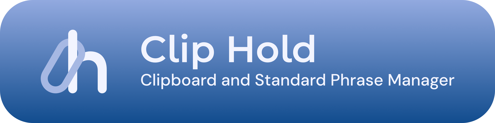
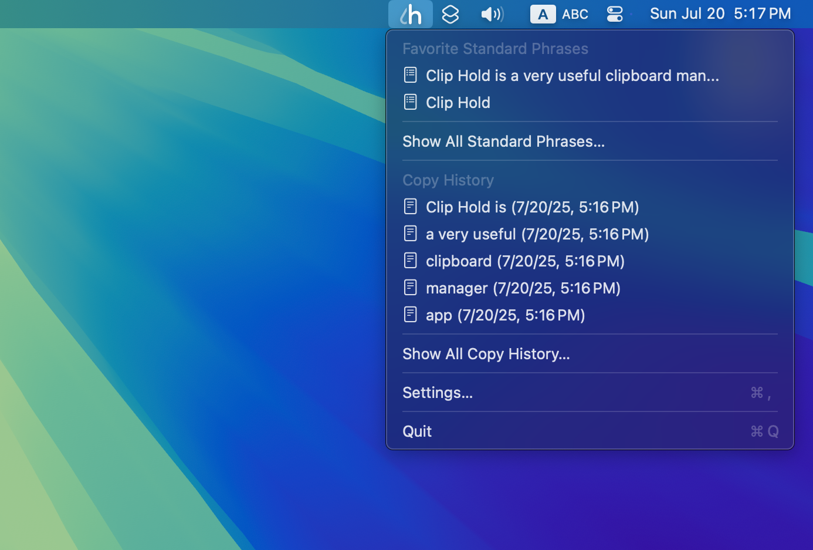
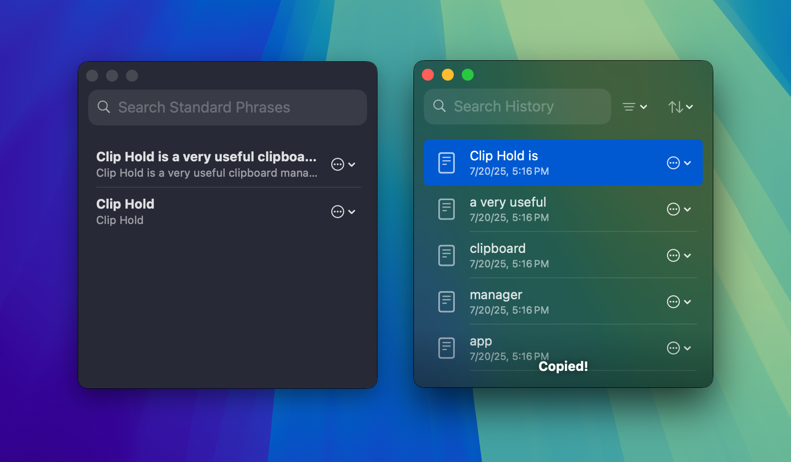
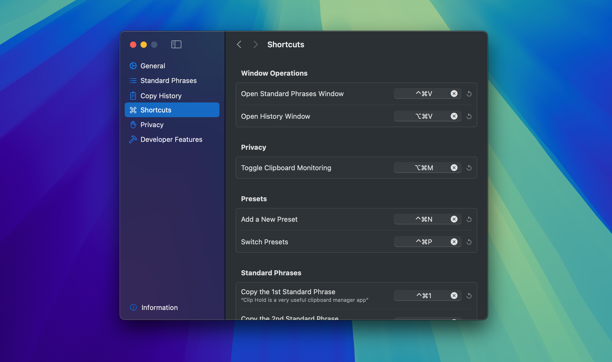
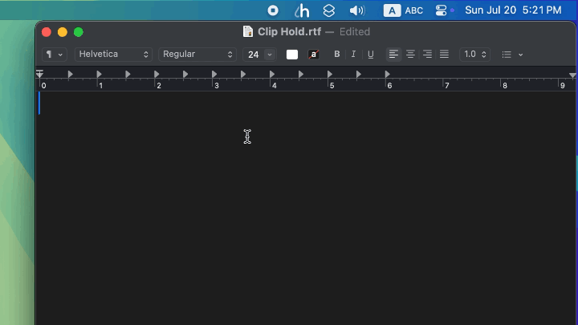
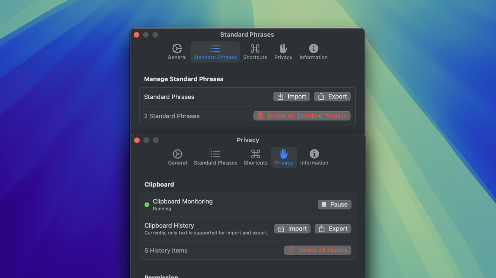
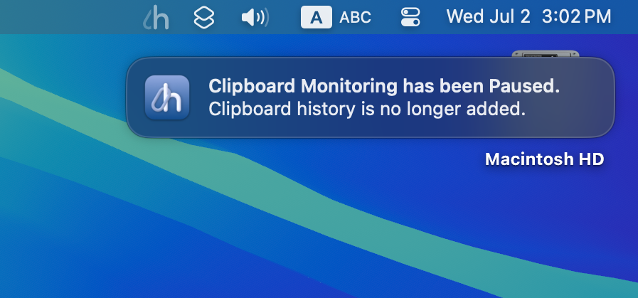
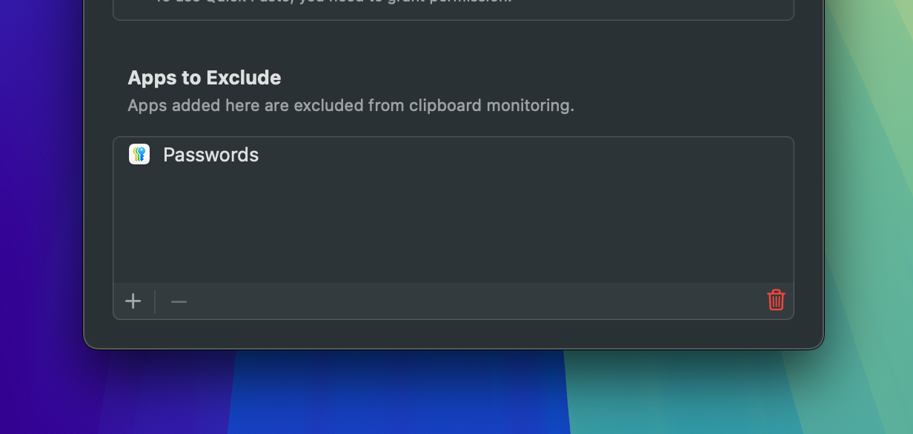

# Clip Hold
**English** | [日本語](docs/README-ja.md)

  
  &nbsp;
  
  &nbsp;
  

## Table of Contents
- [What is Clip Hold?](#what-is-clip-hold)
  - [Download](#download)
  - [System Requirements](#system-requirements)
  - [Differences between free and paid versions](#differences-between-free-and-paid-versions)
- [Introduction of Features](#introduction-of-features)
  - [Quick Access to Standard Phrases and History from the Menu](#quick-access-to-standard-phrases-and-history-from-the-menu)
  - [Standard Phrases Window and History Window](#standard-phrases-window-and-history-window)
  - [Rich Shortcut Keys](#rich-shortcut-keys)
  - [Quickly Paste with Quick Paste](#quickly-paste-with-quick-paste)
  - [Import and Export Features](#import-and-export-features)
  - [Perfect Privacy](#perfect-privacy)
    - [Pause anytime you do not want it saved in the history](#pause-anytime-you-do-not-want-it-saved-in-the-history)
    - [You can exclude apps from clipboard monitoring](#you-can-exclude-apps-from-clipboard-monitoring)
- [Support and Feedback](#support-and-feedback)
  - [If you find a bug](#if-you-find-a-bug)
  - [Feedback](#feedback)
  - [Community](#community)
- [Support Developer](#support-developer)
  - [Give It a Star to the Repository](#give-it-a-star-to-the-repository)
  - [Donation](#donation)
    - [Buy Me a Coffee](#buy-me-a-coffee)
    - [PayPal.Me](#paypalme)
- [Credits](#credits)
  - [Google Gemini by Google](#google-gemini-by-google)
  - [KeyboardShortcuts by Sindre Sorhus](#keyboardshortcuts-by-sindre-sorhus)
  - [create-dmg by Andrey Tarantsov and Andrew Janke](#create-dmg-by-andrey-tarantsov-and-andrew-janke)

## What is Clip Hold?
Clip Hold is a clipboard and standard phrase manager app for macOS.

> [!NOTE]
> Clip Hold was developed using a generative AI. Therefore, it may not follow best practices or contain unstable code.

### Download
Clip Hold can be downloaded for free from the [**release page**](https://github.com/taikun114/Clip-Hold/releases/latest) or purchased from the [**Mac App Store**](https://apps.apple.com/app/clip-hold/id6748125479) for $2.99 (it is based on 500 JPY, so the price may change automatically).

### System Requirements
Clip Hold requires **macOS Sonoma (14.0) or later**. It is compatible with **Intel-based Mac computers** and **Mac computers with Apple silicon**.

### Differences between free and paid versions
Clip Hold has a free version (GitHub version) and a paid version (Mac App Store version), but there is almost no difference in functionality between them. The only difference is the **availability of an automatic update function**.\
The paid version can automatically update and install through the App Store's features, but the free version does not currently have an update checking and installation function (so there is no difference in any of the app's functionality!) 

I would be grateful if you could purchase it from the App Store, but if you download it for free first and feel it is very useful, I would be very happy if you could purchase it or make a [**donation**](#donation)!

## Introduction of Features
Clip Hold is not just a clipboard manager. \
It is a clipboard manager app with a lot of very useful features that were designed by me, a power user who has been using Mac for more than 10 years.

### Quick Access to Standard Phrases and History from the Menu

Frequently used standard phrases and copy history items can be accessed quickly from the menu. You can easily copy an item by simply clicking on it.

### Standard Phrases Window and History Window

You can list all standard phrases you have set and all saved history items. You can easily copy an item by simply double-clicking on it.

### Rich Shortcut Keys

Dedicated shortcut keys allow you to quickly copy up to 10 standard phrases and 10 copy history items. You can also open the standard phrases and history windows instantly.

### Quickly Paste with Quick Paste

With the "Quick Paste” feature, when you copy an item from the menu or use a shortcut key, the copied content is immediately pasted. You don't need to paste it yourself.

### Import and Export Features

Standard phrases and clipboard history can be imported and exported. You can share your favorite standard phrases with someone else, or import clipboard history from another Mac.

### Perfect Privacy
Clip Hold does **not collect any user-related information**.\
While usage data and crash reports may be shared if users have enabled "Share with app developers” under "Analytics & Improvements” in the System Settings' "Privacy & Security” section, the **app itself is entirely devoid of any functionality to collect or send user-related information**. Even if you are concerned about privacy, you can use it with confidence.

Below is an introduction of the privacy features included in the app.

#### Pause anytime you do not want it saved in the history

You can pause clipboard monitoring when you do not want the copied contents to be saved in the history, such as when copying passwords or confidential information.\
While paused, the menu bar icon becomes translucent so you can see the current status at a glance. You will receive a notification when you start the app while it is paused, so you will never forget to resume clipboard monitoring.

#### You can exclude apps from clipboard monitoring

If you do not want the history to be saved only in specific apps, no problem, you can add apps to exclude from clipboard monitoring. There is no need to pause clipboard monitoring.

## Support and Feedback
### If you find a bug
Clip Hold is an application developed using generative AI. I have tested it many times while developing it, but there may still be some bugs or some functions may not operate as intended.

If you find a bug or a behavior problem, please check the [**Issues**](https://github.com/taikun114/Clip-Hold/issues) (known bugs or problems) already opened and look for the same problem reported by others. If you cannot find the same issue, please open a new Issue and report the problem.\
To make bug tracking easier, if you want to report more than one issue, please open a separate Issue for each problem. In other words, if you want to report two bugs, you must open two Issues.

### Feedback
If you do not have a GitHub account and would like to report a bug, share an idea, or send a message to the developer (me), you can click [**this link**](mailto:contact.taikun@gmail.com?subject=Clip%20Hold%20Feedback:%20&body=Please%20describe%20your%20feedback%20in%20detail:%0D%0A%0D%0A%0D%0ASystem%20Information:%0D%0A%0D%0A-%20System%20%0D%0APlease%20enter%20your%20Mac%20model.%0D%0A%0D%0A%0D%0A-%20macOS%20Version%20%0D%0AIf%20you%20are%20experiencing%20problems,%20please%20enter%20the%20macOS%20version.%0D%0A%0D%0A%0D%0A-%20App%20Version%0D%0AIf%20you%20are%20experiencing%20problems,%20please%20enter%20the%20app%20version.%0D%0A%0D%0A) or click the "Send Feedback” button in the "Information” tab in the app settings to send an email (please note that I may not be able to reply to all messages).\
When you open the Send Email window from the button in the app, necessary information, such as Mac system information (Model ID, CPU architecture type, macOS version information) and app version information, will be pre-filled, so sending feedback from there is recommended.

### Community
You can share new features you would like to see added to the app, ask questions about questions about potential issues that may or may not be bugs, exchange opinions with others, and more on the [**discussion page**](https://github.com/taikun114/Clip-Hold/discussions).\
Please use the page as a place to exchange information. I often look in on the page, so messages to the developer are also highly welcome!

## Support Developer
### Give It a Star to the Repository
I would be so glad if you could open [**this page**](https://github.com/taikun114/Clip-Hold) and give it a star by clicking the "Star” button in the upper right corner!\
This button is like a upvote button, and it motivates me to continue development! This feature is free, so if you like Clip Hold, please give it a star!

### Donation
If you like Clip Hold, I would appreciate a donation. It will motivate me to continue development!

You can donate using the following services.

#### Buy Me a Coffee
You can support me at [Buy Me a Coffee](https://www.buymeacoffee.com/i_am_taikun) from the price of a cup of green tea.

#### PayPal\.Me
If you have a PayPal account, you can also donate directly at [PayPal](https://paypal.me/taikun114).

## Credits
### [Google Gemini](https://gemini.google.com/) by Google
Clip Hold was developed using Google's generative AI, Google Gemini (2.5 Flash). As I have no knowledge of programming, including Swift, I would not have been able to complete this app without the help of the generative AI.

### [KeyboardShortcuts](https://github.com/sindresorhus/KeyboardShortcuts) by Sindre Sorhus
The KeyboardShortcuts package was used to implement the global shortcut keys for Clip Hold. Thanks to this package, I was able to implement the shortcut functionality very smoothly.

### [create-dmg](https://github.com/create-dmg/create-dmg) by Andrey Tarantsov and Andrew Janke
The create-dmg shell script was used to create a disk image to distribute the free version. Thanks to this shell script, I was able to easily create a customized disk image.