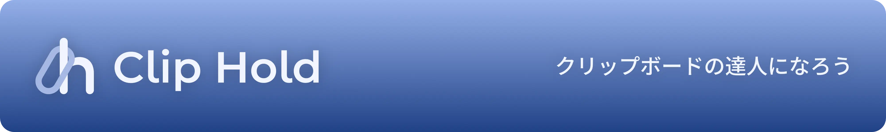
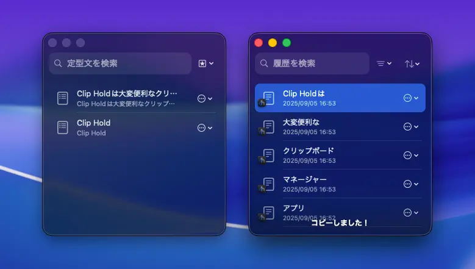
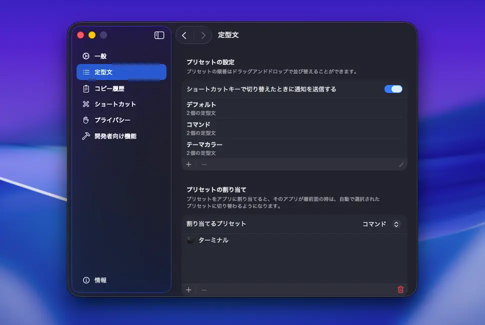
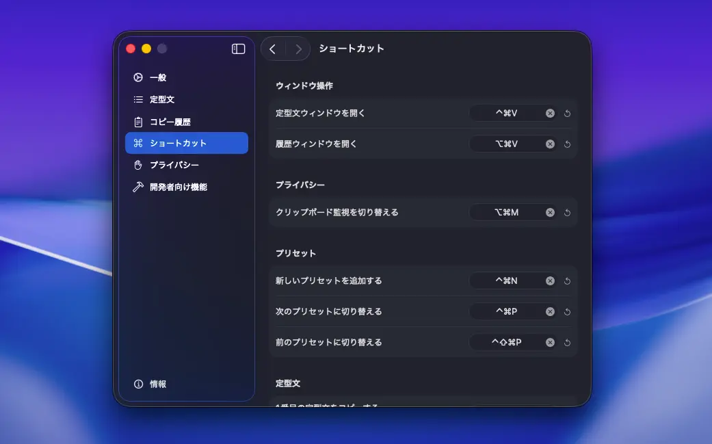
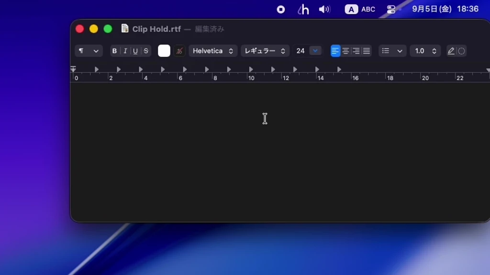
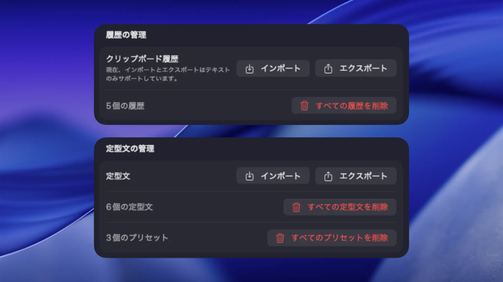
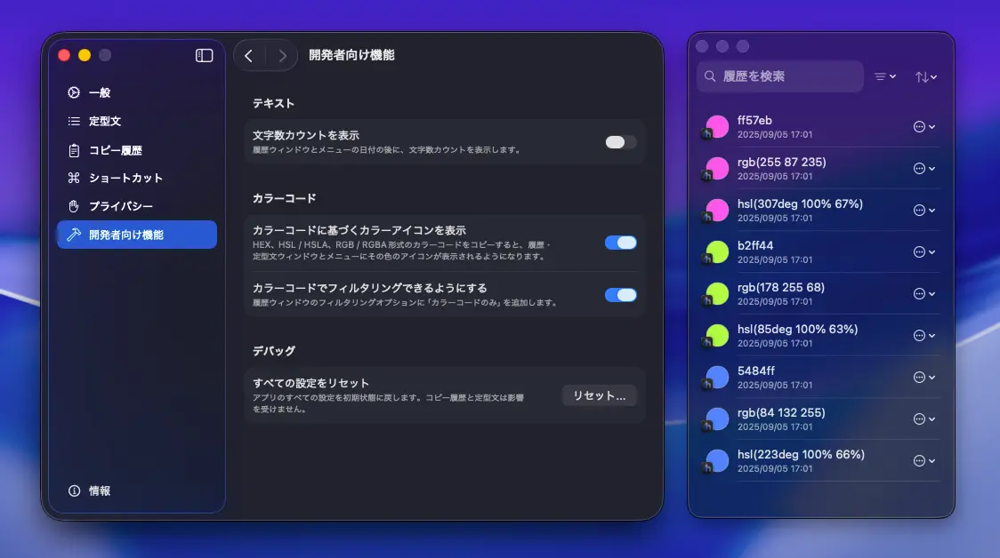
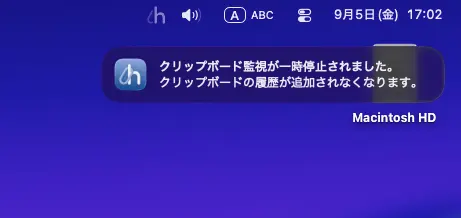
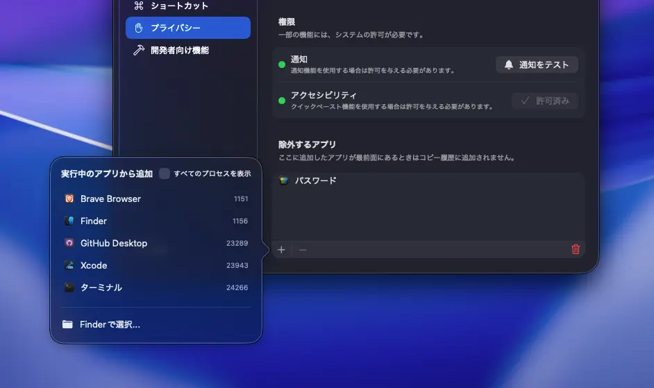

# Clip Hold
[English](/README.md) | **日本語**

  
  &nbsp;
  
  &nbsp;
  

  

## 目次
- [Clip Holdとは？](#clip-holdとは)
  - [ダウンロード](#ダウンロード)
  - [システム要件](#システム要件)
  - [無料版と有料版の違い](#無料版と有料版の違い)
- [機能紹介](#機能紹介)
  - [メニューから定型文と履歴にすぐアクセス](#メニューから定型文と履歴にすぐアクセス)
  - [定型文ウィンドウと履歴ウィンドウ](#定型文ウィンドウと履歴ウィンドウ)
  - [定型文のプリセットとアプリ割り当て機能](#定型文のプリセットとアプリ割り当て機能)
  - [充実したショートカットキー](#充実したショートカットキー)
  - [クイックペーストですぐにペースト](#クイックペーストですぐにペースト)
  - [インポートとエクスポート機能](#インポートとエクスポート機能)
  - [コピーしたカラーコードを表示できる](#コピーしたカラーコードを表示できる)
  - [プライバシーもバッチリ](#プライバシーもバッチリ)
    - [履歴に保存されて欲しくない時はいつでも一時停止](#履歴に保存されて欲しくない時はいつでも一時停止)
    - [クリップボード監視からアプリを除外できる](#クリップボード監視からアプリを除外できる)
- [サポートとフィードバック](#サポートとフィードバック)
  - [バグを見つけた場合](#バグを見つけた場合)
  - [フィードバック](#フィードバック)
  - [コミュニティ](#コミュニティ)
- [開発者をサポート](#開発者をサポート)
  - [リポジトリにスターをつける](#リポジトリにスターをつける)
  - [寄付](#寄付)
    - [Buy Me a Coffee](#buy-me-a-coffee)
    - [PayPal.Me](#paypalme)
- [クレジット](#クレジット)
  - [Google Gemini by Google](#google-gemini-by-google)
  - [Gemini CLI by Google](#gemini-cli-by-google)
  - [Qwen Code by Qwen](#qwen-code-by-qwen)
  - [KeyboardShortcuts by Sindre Sorhus](#keyboardshortcuts-by-sindre-sorhus)
  - [create-dmg by Andrey Tarantsov and Andrew Janke](#create-dmg-by-andrey-tarantsov-and-andrew-janke)

## Clip Holdとは？

Clip Holdは、macOS用のクリップボードと定型文マネージャーアプリです。

> [!NOTE]
> Clip Holdの開発には生成AIが活用されました。そのため、ベストプラクティスに沿っていなかったり、不安定なコードが含まれていたりする可能性があります。

### ダウンロード
Clip Holdは[**リリースページ**](https://github.com/taikun114/Clip-Hold/releases/latest)から無料でダウンロードするか、[**Mac App Store**](https://apps.apple.com/jp/app/clip-hold/id6748125479)から500円で購入することができます。

### システム要件
Clip Holdを実行するには、**macOS Sonoma（14.0）またはそれ以降**が必要です。**Intelプロセッサを搭載したMac**と**Appleシリコンを搭載したMac**に対応しています。

### 無料版と有料版の違い
Clip Holdには無料版（GitHub版）と有料版（Mac App Store版）がありますが、どちらもほとんど機能の違いはありません。**唯一の違いは自動アップデート機能の有無**です。\
有料版ではApp Storeの機能でアップデートとインストールを自動で行うことができますが、無料版では今のところアップデート確認機能とインストール機能は搭載されていません（つまり、アプリの機能としては何一つ変わりません！）。

私としてはApp Storeから購入してくださるとありがたいですが、まずは無料でダウンロードしてみて、とても便利だと思ったら購入したり[**寄付**](#寄付)したりしてくださると大変嬉しいです！

## 機能紹介
Clip Holdはただのクリップボードマネージャーではありません。\
10年以上Macを使い続けているパワーユーザーの私が考えた、大変便利な機能がたくさん詰まったクリップボードマネージャーアプリです。

### メニューから定型文と履歴に素早くアクセス

よく使う定型文とコピー履歴には、メニューからすぐにアクセスできます。項目をクリックするだけで簡単にコピーすることができます。

### 定型文ウィンドウと履歴ウィンドウ

設定したすべての定型文と、保存されたすべての履歴を一覧表示することができます。項目をダブルクリックするだけで簡単にコピーすることができます。

### 定型文のプリセットとアプリ割り当て機能

定型文をプリセットごとに分けて、開いたアプリによって自動でプリセットを切り替えることができます。プリセットはショートカットキーで切り替えることもできます。

### 充実したショートカットキー

各10個までの定型文とコピー履歴をすぐさまコピーできるショートカットキーが用意されており、素早くコピーすることができます。定型文や履歴ウィンドウを開くのも一瞬。

### クイックペーストですぐにペースト

「クイックペースト」機能を使えば、メニューで項目をコピーした時やショートカットキーを使ってコピーしたとき、コピーした内容が即座にペーストされます。わざわざ自分でペーストする必要はありません。

### インポートとエクスポート機能

定型文とクリップボード履歴は、インポートしたりエクスポートしたりすることができます。自分がよく使う定型文を誰かと共有したり、他のMacからのクリップボード履歴を読み込んだりすることができます。

### コピーしたカラーコードを表示できる

「開発者向け機能」設定から有効化すると、コピーしたカラーコードに基づくカラーアイコンを、履歴ウィンドウとメニューに表示させることができます。

### プライバシーもバッチリ
Clip Holdは**ユーザーに関する情報は一切収集しません**。\
システム設定の「プライバシーとセキュリティ」設定内にある「解析と改善」で「アプリデベロッパと共有」をオンにしているユーザーの使用状況データとクラッシュレポートが共有される場合がありますが、**アプリ自体には情報を収集して送信する機能は全く搭載されていません**。プライバシーが心配な方でも安心してお使いいただけます。

以下に、アプリに搭載されているプライバシー機能を紹介します。

#### 履歴に保存されて欲しくない時はいつでも一時停止

パスワードや機密情報をコピーする時など、コピーした内容が履歴に保存されて欲しくない時はクリップボード監視を一時停止することができます。\
一時停止中はメニューバーアイコンが半透明になり、現在の状態が一目でわかります。一時停止の状態でアプリを起動すると通知が届くので、クリップボード監視の再開を忘れることもありません。

#### クリップボード監視からアプリを除外できる

特定のアプリでのみ履歴が保存されて欲しくない時でも大丈夫、クリップボード監視から除外できるアプリを追加できます。わざわざクリップボード監視を一時停止する必要はありません。

## サポートとフィードバック
### バグを見つけた場合
Clip Holdは生成AIを活用して開発されたアプリです。開発中に何度もテストは行いましたが、それでもバグが残っていたり、一部機能が正常に動作しなかったりする場合があります。

バグや動作の問題を見つけた場合は、既に開かれている[**Issue**](https://github.com/taikun114/Clip-Hold/issues)（既知のバグや問題）を確認し、他の方が報告している同じ問題がないか探してみてください。同じ問題が見つからなかった場合は新しいIssueを開き、問題の報告をお願いします。\
バグトラッキングを容易にするため、複数の問題を報告したい場合は1つの問題に対して1つのIssueを開いてください。つまり、2つのバグを報告したい場合は2つのIssueを開く必要があります。

### フィードバック
GitHubアカウントをお持ちでない方のバグ報告やアイデア共有、開発者（私）へのメッセージなど、フィードバックを送りたい場合は[**こちらのリンク**](mailto:contact.taikun@gmail.com?subject=Clip%20Hold%E3%81%AE%E3%83%95%E3%82%A3%E3%83%BC%E3%83%89%E3%83%90%E3%83%83%E3%82%AF%3A%20&body=%E3%83%95%E3%82%A3%E3%83%BC%E3%83%89%E3%83%90%E3%83%83%E3%82%AF%E5%86%85%E5%AE%B9%E3%82%92%E5%85%B7%E4%BD%93%E7%9A%84%E3%81%AB%E8%AA%AC%E6%98%8E%E3%81%97%E3%81%A6%E3%81%8F%E3%81%A0%E3%81%95%E3%81%84%3A%0D%0A%0D%0A%0D%0A%E3%82%B7%E3%82%B9%E3%83%86%E3%83%A0%E6%83%85%E5%A0%B1%3A%0D%0A%0D%0A%E3%83%BB%E3%82%B7%E3%82%B9%E3%83%86%E3%83%A0%0D%0A%E3%81%8A%E4%BD%BF%E3%81%84%E3%81%AEMac%E3%81%AE%E6%A9%9F%E7%A8%AE%E3%82%92%E5%85%A5%E5%8A%9B%E3%81%97%E3%81%A6%E3%81%8F%E3%81%A0%E3%81%95%E3%81%84%E3%80%82%0D%0A%0D%0A%0D%0A%E3%83%BBmacOS%E3%83%90%E3%83%BC%E3%82%B8%E3%83%A7%E3%83%B3%0D%0A%E5%95%8F%E9%A1%8C%E3%81%8C%E8%B5%B7%E3%81%93%E3%81%A3%E3%81%A6%E3%81%84%E3%82%8B%E5%A0%B4%E5%90%88%E3%80%81macOS%E3%81%AE%E3%83%90%E3%83%BC%E3%82%B8%E3%83%A7%E3%83%B3%E3%82%92%E5%85%A5%E5%8A%9B%E3%81%97%E3%81%A6%E3%81%8F%E3%81%A0%E3%81%95%E3%81%84%E3%80%82%0D%0A%0D%0A%0D%0A%E3%83%BB%E3%82%A2%E3%83%97%E3%83%AA%E3%83%90%E3%83%BC%E3%82%B8%E3%83%A7%E3%83%B3%0D%0A%E5%95%8F%E9%A1%8C%E3%81%8C%E8%B5%B7%E3%81%93%E3%81%A3%E3%81%A6%E3%81%84%E3%82%8B%E5%A0%B4%E5%90%88%E3%80%81%E3%82%A2%E3%83%97%E3%83%AA%E3%81%AE%E3%83%90%E3%83%BC%E3%82%B8%E3%83%A7%E3%83%B3%E3%82%92%E5%85%A5%E5%8A%9B%E3%81%97%E3%81%A6%E3%81%8F%E3%81%A0%E3%81%95%E3%81%84%E3%80%82%0D%0A%0D%0A)をクリックするか、アプリ内設定の「情報」タブにある「フィードバックを送信」ボタンからメールをお送りいただけます（すべてのメッセージに返信できるとは限りませんので、あらかじめご了承ください）。\
アプリ内のボタンからメールの送信画面を開くと、Macのシステム情報（機種ID、CPUアーキテクチャの種類、macOSのバージョン情報）やアプリのバージョン情報など、こちらで必要な情報が事前に入力された状態になるため、こちらから送信していただくことをおすすめします。

### コミュニティ
アプリに追加してほしい新機能の共有や、バグかどうかはわからないけど気になる問題など、質問したり他の人と意見交換したりなどが可能な[**ディスカッションページ**](https://github.com/taikun114/Clip-Hold/discussions)が用意されています。\
情報交換の場として、ぜひご活用ください。私もよく覗いているので、開発者へのメッセージも大歓迎です！

## 開発者をサポート
### リポジトリにスターをつける
[**こちらのページ**](https://github.com/taikun114/Clip-Hold)を開き、右上の「Star」ボタンをクリックしてスターをつけてくださるととてもうれしいです！\
このボタンは言わば高評価ボタンのようなもので、開発を続けるモチベーションになります！この機能は無料なので、Clip Holdを気に入ったらぜひスターをつけてください！

### 寄付
Clip Holdが気に入ったら寄付してくださると嬉しいです。開発を続けるモチベーションになります！

以下のサービスを使って寄付していただくことができます。

#### Buy Me a Coffee
[**Buy Me a Coffee**](https://www.buymeacoffee.com/i_am_taikun)で緑茶一杯分の金額からサポートしていただけます。

#### PayPal\.Me
PayPalアカウントをお持ちの方は、[**PayPal**](https://paypal.me/taikun114)で直接寄付していただくこともできます。

## クレジット
### [Google Gemini](https://gemini.google.com/) by Google
Clip Holdの開発には、Googleの生成AIであるGoogle Gemini（2.5 Flash）が使用されました。Swiftを含むプログラムの知識が一切ない自分にとって、生成AIの力がなければこのアプリを完成させることはできなかったでしょう。

### [Gemini CLI](https://github.com/google-gemini/gemini-cli) by Google
Google Geminiを開発に組み込む際、Gemini CLIが大変役に立ちました。自動でコードファイルを書き換えてビルドし、自動で修正までしてくれるため開発する際の作業量が大幅に減りました。

### [Qwen Code](https://github.com/QwenLM/qwen-code) by Qwen
Clip Hold 1.3.0以降の開発ではGoogle Geminiに加え、AlibabaのAI開発チームであるQwenによって開発されたQwen Codeが使用されました。Qwen Codeでは高度なコーディングモデル（Clip Hold 1.3.0の開発時点ではQwen3 Coder Plus）が利用でき、1日あたり最大2000リクエストまで無料で使用できるという大変寛大な利用制限のおかげで、開発を中断することなく、スムーズに開発し続けることができました。

### [KeyboardShortcuts](https://github.com/sindresorhus/KeyboardShortcuts) by Sindre Sorhus
Clip Holdのグローバルショートカットキーの実装にはKeyboardShortcutsパッケージが使用されました。このパッケージのおかげで、非常にスムーズにショートカット機能を実装することができました。

### [create-dmg](https://github.com/create-dmg/create-dmg) by Andrey Tarantsov and Andrew Janke
無料版を配布するためのディスクイメージを作成するのにcreate-dmgシェルスクリプトが使用されました。このシェルスクリプトのおかげで、カスタマイズされたディスクイメージを簡単に作成することができました。